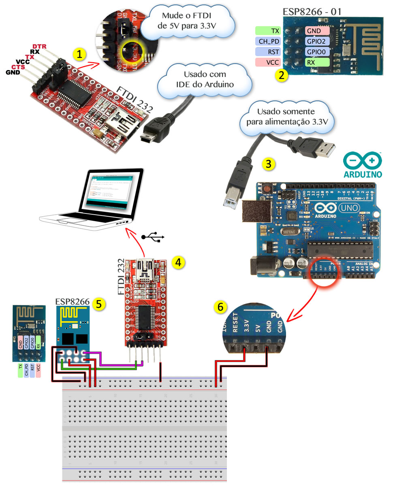

# Setup

## Descrição da Imagem:

1. **FTDI 232:** Mudar chave de 5V para 3.3V; Ligar ao USB do computador.
2. **ESP8266:** Descrição dos pinos.
3. **ARDUINO UNO:** Irá alimentar a protobord com 3.3V e ligar alguns pinos do ESP8266. USB pode ser ligar ao computador, porém, cuidado na hora de escolher a porta de upload na IDE do Arduino. Você deve escolher a porta USB do FTDI na IDE.
4. Ligar o FTDI no computador e na IDE do Arduino, escolher a porta do FTDI
5. Fazer as conexões do ESP8266, lembrando q ele será alimentado pelo Arduino
6. Ligar GND do Arduino na protoboard, trilha negatica; Logo, 3.3V na trilha positiva.

## Códigos:

Observe que neste repositório existe o diretório "Blink" e dentro dele, existe o arquivo "Blink.ino". Este arquivo não é diferente em nada do Exemplo encontrado na IDE do Arquino, no submenu "esp8266".

## Setup de IDE e Exemplo de Upload de Sketch:

https://www.youtube.com/watch?v=xi2s1P57XPE

## Dicas:

1. Antes de qualquer atividade, sempre ligue fios "GND" nas placas
2. Primeiramente ligue o FTDI no computador, logo após, ligue o Arduino. Se você ligar o Arduino primeiro, o FTDI recebe algum tipo carga pelo GND e acende um Led muito fraco e por algum outro motivo, nessa sequência, não se comunica com o ESP8266.
3. Não recomendo ligar o VCC no FTDI para alimentar o ESP8266, meu ESP8266 começou a esquentar e não consegui encontrar a rede WiFi da placa; Acredito que seja pouca amperagem.

## Referências:

1. http://labdegaragem.com/group/esp8266-na-garagem/forum
2. http://labdegaragem.com/group/esp8266-na-garagem/page/getting-started-with-esp8266
3. https://www.youtube.com/watch?v=do31PoRwIO4
4. https://www.youtube.com/watch?v=ETLDW22zoMA
5. https://www.dropbox.com/s/8rh7dlsds5f0o81/M%C3%B3dulo%20ESP8266-01-002.pdf?dl=0
6. http://api.ning.com/files/3oumJFYFk4oOVbKZOVYLVUaw8V5qJMsBl*enA8yoOx1t6NC5a4KdCB6cKEJrLoEmiTCddrUFxiyb1pQ*t99X4p3GgzHDYKYJ/Mini_Tuto_ESP826612.pdf
